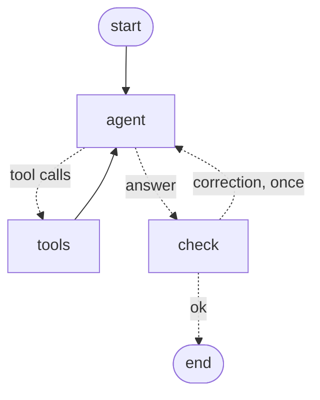

# LangGraph order agent

A small LangGraph agent for a dental parts supplier's staff: it answers order questions from
tools, hands broad questions to a sub-agent, and pauses for a person's approval before it
changes anything. The data is made up and lives in memory.

It is a compact version of patterns I run in production on a staff assistant I built
(a custom Python agent loop with MCP tools, approval cards and answer checks). This repo shows
the same ideas expressed in LangGraph.



## What it shows

| Pattern | Where | How |
|---|---|---|
| Tool-calling loop | `order_agent/graph.py` `agent`, `tools` | `StateGraph` with a conditional edge; capped at `MAX_ROUNDS` tool rounds per turn, after which the model must answer with what it has |
| Human approval | `graph.py` `run_tools` | Writes (`cancel_order`, `update_order_status`) call `interrupt()` with a card per change *before anything runs*; the caller resumes with `Command(resume={"approved": [...]})`. Declined changes come back to the model as "Not done". Each approved call runs once |
| Sub-agent with isolated context | `order_agent/subagent.py` | `research_clinic` is its own `create_react_agent` graph with two read tools and a fresh prompt; the parent sees only its short summary, not its tool trace |
| Answer checks | `graph.py` `check` | Three rules on the final answer: figures need a data tool behind them; "I've cancelled…" needs a write that actually ran; every order id named must come from this turn (user, tool call or tool result). A failing answer goes back once with a correction, using `Command(goto=...)` |
| Persistence | `MemorySaver` checkpointer | Conversations are kept per `thread_id`, which is also what makes pause-and-resume work |
| Model-agnostic | `order_agent/models.py` | `ollama:<model>` (local) or `anthropic:<model>`; the graph doesn't change |
| Tests without a model | `tests/test_graph.py` | A scripted chat model drives every path: approval, decline, failed write, each check, round limit, sub-agent isolation, thread memory |

## Run it

Needs Python 3.9+ and either [Ollama](https://ollama.com) with `gpt-oss:20b` pulled, or an
Anthropic API key.

```bash
python3 -m venv .venv && .venv/bin/pip install -r requirements.txt
.venv/bin/pytest -q
.venv/bin/python -m order_agent.cli
ANTHROPIC_API_KEY=... .venv/bin/python -m order_agent.cli --model anthropic:claude-sonnet-5-5
```

Try: "How many orders are processing and what are they worth?", "Anything stuck for Elm Street
Smiles?", "Cancel SO-1005, the clinic changed their plan.", "Cancel SO-1002".

## What I learned running it on local models

- **gpt-oss:20b** answered every question above correctly: $2,738.00 across 3 processing orders,
  SO-1003 stuck on out-of-stock IMP-4511 (from the sub-agent's summary), the cancel waited for
  approval, and it refused to cancel the shipped SO-1002.
- **qwen3:8b** got the sub-agent's summary right but garbled the ids when restating it
  ("Orders 101 and 103"). That is what the order-id check is for; it now sends such an answer
  back. On another run it called an out-of-stock item "in stock", which no regex catches: the
  checks narrow what a small model can get wrong, they don't replace a capable one.
- gpt-oss writes ids with a non-breaking hyphen (`SO‑1003`), which silently slipped past the
  first version of the id check. The check now normalizes dashes, and there is a test for it.
